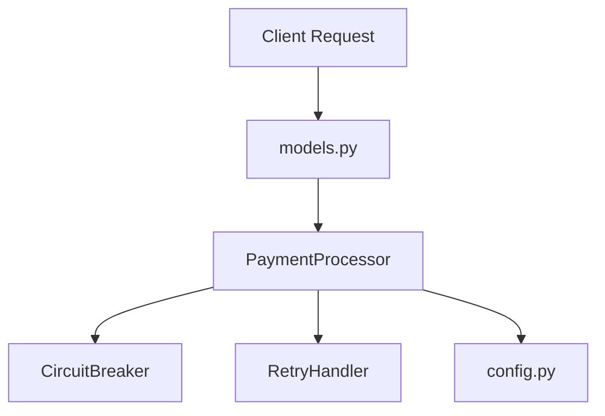

# 💳 Demo Payment Service

[](LICENSE)
[](https://www.python.org/)
[](#)

A demonstrator payment gateway service implementing secure transaction processing, client retry coordination, idempotency validation, and gateway circuit breaking.

This repository serves as a target codebase for verification by the **ReviewGuard** multi-agent code analysis suite.

---

## 🎨 Component Design Architecture



### Core Architecture Guidelines
1. **Idempotency**: All incoming payment request transactions must supply an idempotency key to prevent double charging. Duplicate keys within the TTL window return cached results.
2. **Circuit Breaking**: The gateway communication module is wrapped inside a state-monitoring `CircuitBreaker` pattern to isolate transient downstream failures.
3. **Exponential Retries**: Failed transactions run through a centralized `RetryHandler` applying exponential backoff delay with randomized jitter.
4. **Typed Exceptions**: Operations throw specific subclasses of `ServiceException` (e.g., `PaymentException`, `CircuitBreakerOpenException`), preventing generic stack traces from reaching client boundaries.

---

## 📁 Project Structure

*   **`src/`**: Payment processing package source:
    *   `config.py`: Single source of truth for retry limiters and TTL configs.
    *   `exceptions.py`: Typed ServiceException hierarchy.
    *   `models.py`: Data request models.
    *   `retry_handler.py`: Centralized exponential retries.
    *   `payment_processor.py`: Orchestrates transaction processing, caching, and circuit breaking.
    *   `refund_service.py`: Refund execution with idempotency protection.
*   **`tests/`**: Automated pytest test suite.
*   **`review-artifacts/`**: ReviewGuard integration folders:
    *   `memory/team-decisions.json`: Bootstrapped team coding decisions.
    *   `memory/pattern-history.json`: Mined guideline histories.

---

## 🛠️ Local Development & Testing

Run unit tests locally using the virtual environment interpreter:

```bash
# Execute unit tests
python -m pytest tests/
```
