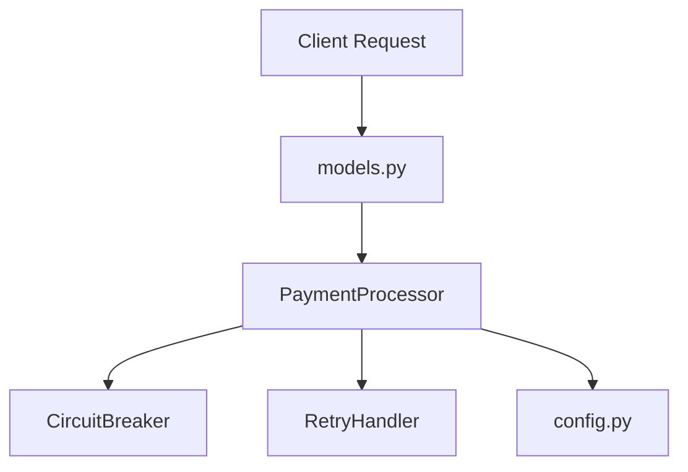

# Demo Payment Service Architecture

## Component Design

## Architectural Guidelines
1. **Idempotency**: All payment requests require an idempotency key.
2. **Circuit Breaking**: The payment gateway client is wrapped in a CircuitBreaker pattern to protect against cascading backend failure.
3. **Robust Retries**: The retry handler is centralized and uses exponential backoff delay combined with randomized jitter.
4. **Exception Strategy**: Subclasses of ServiceException are used to define error parameters. Propagation of bare runtime exceptions to client layers is blocked.
